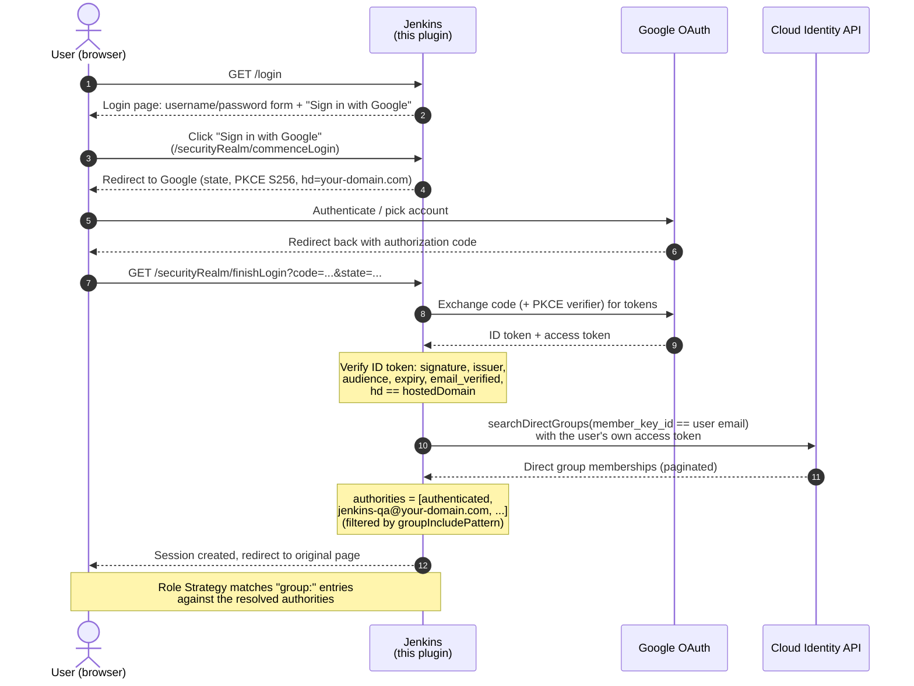

# Google Groups OAuth Security Realm


A Jenkins security realm that lets users **sign in with Google** and turns their
**Google Group memberships into Jenkins authorities**, so role-based access control can
be managed by adding/removing people in Google Groups instead of maintaining local
Jenkins users. A local **username/password fallback** is kept as a break-glass path.

```
Onboard a QA engineer   ->  add them to jenkins-qa@your-domain.com. Done.
Offboard them           ->  remove them from the group. Applies at their next login;
                            their API tokens lose it within groupAuthorityMaxAgeDays.
```

---

## Table of contents

- [Features](#features)
- [How it works](#how-it-works)
- [Requirements](#requirements)
- [Installation](#installation)
- [Configuration](#configuration)
  - [Step 1: Google Cloud setup](#step-1-google-cloud-setup)
  - [Step 2: Create the Google Groups](#step-2-create-the-google-groups)
  - [Step 3: Configure the Jenkins realm](#step-3-configure-the-jenkins-realm)
  - [Step 4: Bind roles to groups](#step-4-bind-roles-to-groups)
- [Configuration reference](#configuration-reference)
- [The login page](#the-login-page)
- [Troubleshooting](#troubleshooting)
- [Limitations](#limitations)
- [Building from source](#building-from-source)
- [License](#license)

---

## Features

- **Sign in with Google:** OAuth 2.0 code flow with PKCE; ID token fully verified
  (signature, issuer, audience, expiry, `email_verified`, hosted-domain claim).
- **Google Groups as authorities:** the user's direct group memberships (as
  lowercase group emails) become Jenkins authorities, usable in any authorization
  strategy (e.g. [Role Strategy](https://plugins.jenkins.io/role-strategy/)).
- **No admin grant needed:** groups are resolved with the *logged-in user's own*
  OAuth token via the Cloud Identity API. No service account, no domain-wide
  delegation, no Workspace super-admin involvement.
- **Break-glass password login:** the standard username/password form keeps working
  for users created under the previous local-database realm, so a Google outage or
  misconfiguration never locks you out.
- **API tokens unaffected:** existing automation users keep authenticating with
  their Jenkins API tokens.
- **Offboarding-safe API tokens:** group permissions used by API tokens expire a
  configurable number of days after the user's last Google login (default 7).
- **Account binding:** each Jenkins user is bound to the Google account (`sub`) that
  first signed in with that email, so a reassigned email address cannot take over the
  previous owner's API tokens, credentials or permissions.
- **Configuration as Code:** first-class [JCasC](https://plugins.jenkins.io/configuration-as-code/)
  support, including env-var interpolation for every field.
- **`/securityRealm/whoami`:** a self-service debug page showing exactly which
  authorities were resolved at login.

## How it works



- The Jenkins **user id is the full email**, lowercase, bound at first login to the
  Google account's stable id (`sub`). A later login with the same email but a different
  Google account (for example after the address was reassigned) is refused.
- Authorities are re-resolved at every Google login and last for the session.
- API-token requests reuse the group authorities recorded at the user's most recent
  Google login for `groupAuthorityMaxAgeDays` days; after that they carry only
  `authenticated` until the user signs in with Google again.

## Requirements

| Requirement | Version / notes |
|---|---|
| Jenkins | 2.555.3 or newer (plugin baseline) |
| Java | 21+ (Jenkins controller) |
| Google Workspace / Cloud Identity | any edition (premium **not** required) |
| GCP project | with the **Cloud Identity API** enabled |
| Jenkins URL | must be configured in *Manage Jenkins → System* (used to build the OAuth redirect URI; Google login is refused without it) |

## Installation

### Option A: install the `.hpi` via the UI

1. Download `google-groups-oauth.hpi` from the releases page (or build it, see
   [Building from source](#building-from-source)).
2. In Jenkins: **Manage Jenkins → Plugins → Advanced settings → Deploy Plugin**,
   choose the `.hpi`, deploy, and restart Jenkins.

### Option B: bake into a custom controller image (recommended for Kubernetes)

```dockerfile
FROM jenkins/jenkins:2.555.3-jdk21
COPY google-groups-oauth.hpi /usr/share/jenkins/ref/plugins/google-groups-oauth.jpi
```

> [!IMPORTANT]
> Do **not** switch the security realm before completing the
> [Google Cloud setup](#step-1-google-cloud-setup); keep a break-glass admin
> (see [The login page](#the-login-page)) until the Google login path is proven.

## Configuration

### Step 1: Google Cloud setup

1. Open the [Google Cloud console](https://console.cloud.google.com/) and select (or
   create) a project.
2. **Enable the Cloud Identity API**:
   *APIs & Services → Library → search "Cloud Identity API" → Enable*.
3. **Configure the OAuth consent screen** (*APIs & Services → OAuth consent screen*):
   - User type: **Internal**. This restricts sign-in to accounts in your Google
     Workspace organization *and* skips Google's sensitive-scope verification review.
4. **Create the OAuth client** (*APIs & Services → Credentials → Create credentials →
   OAuth client ID*):
   - Application type: **Web application**
   - Authorized redirect URI:

     ```
     https://<your-jenkins-url>/securityRealm/finishLogin
     ```
5. Note the **Client ID** and **Client secret**; you'll need them in Step 3.

The plugin requests these scopes (no consent-screen scope pre-registration is needed
for Internal apps):

```
openid email profile
https://www.googleapis.com/auth/cloud-identity.groups.readonly
```

### Step 2: Create the Google Groups

Create one Google Group per Jenkins role, e.g.:

| Group | Purpose |
|---|---|
| `jenkins-admins@your-domain.com` | Jenkins administrators |
| `jenkins-qa@your-domain.com` | QA engineers |
| `jenkins-developers@your-domain.com` | Developers |
| `jenkins-report-viewers@your-domain.com` | Read-only report access |

> [!WARNING]
> **Keep these groups flat.** Only *direct* memberships resolve; nested groups never
> appear (the transitive-membership API requires Workspace Enterprise Standard/Plus or
> Cloud Identity Premium). Add every user directly to each group.
>
> Also keep the groups' default **member-visibility settings**: Google silently omits
> groups whose membership the caller is not allowed to view.

### Step 3: Configure the Jenkins realm

**Via the UI:** *Manage Jenkins → Security → Security Realm →
"Sign in with Google (Google Groups authorities)"*, then fill in the fields from the
[reference table](#configuration-reference) below.

**Via JCasC (recommended):**

```yaml
jenkins:
  securityRealm:
    googleGroupsOAuth:
      clientId: "1234567890-abc.apps.googleusercontent.com"
      clientSecret: "${google-oauth-client-secret}"            # JCasC secret source
      hostedDomain: "your-domain.com"                          # required; hd claim check
      groupIncludePattern: "^jenkins-.*@your-domain\\.com$"    # optional authority filter
      onGroupLookupFailure: "DEGRADE"                          # DEGRADE | FAIL
      groupAuthorityMaxAgeDays: 7                              # API-token group expiry; 0 = never
```

Every field supports JCasC interpolation, from environment variables or any other
secret source (e.g. files mounted under `/run/secrets/`):

```yaml
jenkins:
  securityRealm:
    googleGroupsOAuth:
      clientId: "${GOOGLE_OAUTH_CLIENT_ID}"
      clientSecret: "${GOOGLE_OAUTH_CLIENT_SECRET}"
      hostedDomain: "${GOOGLE_HOSTED_DOMAIN:-your-domain.com}"   # ${VAR:-default} works
      groupIncludePattern: "${GOOGLE_GROUP_PATTERN:-^jenkins-.*@your-domain\\.com$}"
      onGroupLookupFailure: "${GROUP_LOOKUP_FAILURE_POLICY:-DEGRADE}"
```

> [!TIP]
> Prefer a **mounted-secret source** over an env var for `clientSecret`: on
> Kubernetes, a secret mounted under `/run/secrets/` is referenced by file name, stays
> out of the pod spec, and rotations apply on the next JCasC reload, while env-var
> changes require a pod restart.

### Step 4: Bind roles to groups

With the [Role Strategy plugin](https://plugins.jenkins.io/role-strategy/), bind roles
to **group emails** (lowercase). Keep `user:` entries for automation accounts and
break-glass admins:

```yaml
jenkins:
  authorizationStrategy:
    roleBased:
      roles:
        global:
          - name: "admin"
            permissions: ["Overall/Administer"]
            entries:
              - group: "jenkins-admins@your-domain.com"
              - user: "admin"                    # break-glass local admin, keep it
          - name: "qa"
            permissions: ["Overall/Read", "Job/Build", "Job/Read"]
            entries:
              - group: "jenkins-qa@your-domain.com"
              - user: "qaautomation"             # API-token automation user, keep it
```

That's it. Membership changes in Google Groups apply at each user's next login, and
to their API tokens within `groupAuthorityMaxAgeDays` (see [Offboarding](#offboarding)).

## Configuration reference

| Field | Required | Default | Description |
|---|---|---|---|
| `clientId` | Yes | *(none)* | OAuth client ID from Step 1 |
| `clientSecret` | Yes | *(none)* | OAuth client secret (stored encrypted as `hudson.util.Secret`) |
| `hostedDomain` | Yes | *(none)* | Workspace domain, e.g. `your-domain.com`. Logins are **rejected** unless the verified ID token's `hd` claim equals this (defense in depth on top of the Internal consent screen) |
| `groupIncludePattern` | No | *(all groups)* | Java regex; only matching group emails become authorities. Keeps authority lists small, e.g. `^jenkins-.*@your-domain\.com$` |
| `groupAuthorityMaxAgeDays` | No | `7` | Days that the group authorities recorded at a user's last Google login stay valid for **API-token** requests. Jenkins never re-checks Google between logins, so this bounds how long a removed member keeps group permissions through their tokens. After expiry, token requests carry only `authenticated` until the user signs in with Google again. `0` = never expire (not recommended). Local users are not affected |
| `onGroupLookupFailure` | No | `DEGRADE` | What to do when the group lookup fails at login: `DEGRADE` = log in with only the `authenticated` authority and log a loud WARNING; `FAIL` = refuse the login. Failures are never cached as "no groups" |

Behavior notes:

- **Sign-up is always disabled**; users cannot self-register.
- **Group cache:** successful lookups are cached for 60 seconds per user to absorb
  login storms; failures are never cached.
- **Authorities refresh at login**, not in the background: a removed group membership
  persists until that user's session ends and they log in again, and in their API
  tokens for up to `groupAuthorityMaxAgeDays`.

### Offboarding

Removing someone from a Google Group (or from the Workspace) does not reach Jenkins
immediately, because Jenkins only talks to Google when that person signs in:

| Access path | When the removal takes effect |
|---|---|
| New Google login | Immediately (the group is gone, or the login fails) |
| Existing browser session | When the session ends (Jenkins session timeout) |
| API tokens | After `groupAuthorityMaxAgeDays` without a Google login (default 7 days) |

For immediate removal (for example, a departing administrator), also **delete the
person's Jenkins user** (*Manage Jenkins → Users*). That revokes their API tokens and
ends their access at once.

### Email address reuse

Each Jenkins user record is bound to the Google account (`sub` claim) that first signed
in with its email. If the address is later given to a different Google account, that
account's login is **refused** with a log message naming both account ids, rather than
inheriting the old record's API tokens, user-scoped credentials and `user:` grants. To
let the new owner in, delete the old Jenkins user record first. Records created before
this binding existed are bound at their next Google login.

## The login page

The standard Jenkins login page shows **both** options:

- **Username/password form:** validated against the password hashes stored on user
  records created under the previous local-database realm. This is the break-glass
  path: if Google OAuth is down or misconfigured, pre-existing local admins can still
  sign in. Users who only ever logged in via Google have no stored password and cannot
  use the form.
- **"Sign in with Google" button:** starts the OAuth flow. Users with an active
  Google session typically see at most an account-chooser click.

> [!NOTE]
> Since sign-up is disabled, the set of password-capable users is frozen at migration
> time. Verify at least one local admin's password **before** switching the realm.

## Troubleshooting

**A user's permissions are missing.**
Ask them to open `https://<your-jenkins-url>/securityRealm/whoami`: it lists the
authorities resolved at their login and is deliberately reachable without Overall/Read
(a user whose groups were all filtered may have no permissions at all).

**A group is missing from whoami.** In order of likelihood:

1. The user is a **nested** member (via a sub-group); only direct memberships
   resolve. Add them directly.
2. The group's **member-visibility settings** hide memberships from members; Google
   then silently omits the group. Restore default visibility.
3. The group email doesn't match your `groupIncludePattern`.
4. The Cloud Identity API is not enabled on the OAuth client's GCP project.

**Every login is also logged** at INFO with the full resolved authority list:

```
Google login: alice@your-domain.com authorities=[authenticated, jenkins-qa@your-domain.com]
```

**Common errors:**

| Symptom | Cause / fix |
|---|---|
| `Google login is not configured correctly: ...` (HTTP 500) | The message names what is missing: Client ID, hosted domain, or the Jenkins URL (*Manage Jenkins → System → Jenkins URL*). Password login keeps working meanwhile |
| `this email address belongs to a different Google account` | The email was reassigned to a new Google account; see [Email address reuse](#email-address-reuse) |
| `redirect_uri_mismatch` from Google | The authorized redirect URI in GCP must be exactly `https://<jenkins-url>/securityRealm/finishLogin` |
| `hd claim ... does not match` in logs | User signed in with an account outside `hostedDomain`; rejection is expected |
| `State did not match or login session expired` | Stale/expired login attempt (or cookies blocked); just retry |
| Login refused with `onGroupLookupFailure=FAIL` | Group lookup failed (network/API error); check controller logs, and switch to `DEGRADE` if lockout risk outweighs missing groups |

## Limitations

- **Direct (flat) group memberships only:** a consequence of using the free-tier
  Cloud Identity API with the user's own token. Revisit only with premium Workspace
  licensing (`searchTransitiveGroups`).
- **Silent group filtering** by Google (visibility settings) cannot be detected
  server-side in user-token mode; mitigated by login logging and `whoami`.
- **No background authority refresh:** changes apply at next login (and to API tokens
  within `groupAuthorityMaxAgeDays`); see [Offboarding](#offboarding).
- The realm is intentionally designed so a **service-account resolver mode** (Cloud
  Identity Groups Reader or Admin SDK with domain-wide delegation) can be added later
  without redesigning; not implemented in v1.

## Building from source

```bash
./mvnw verify          # build + tests -> target/google-groups-oauth.hpi
./mvnw hpi:run         # throwaway Jenkins with the plugin at http://localhost:8080/jenkins
```

> [!WARNING]
> Use the bundled Maven Wrapper (`./mvnw`). The Debian/Ubuntu-packaged Maven
> (`apt install maven`) cannot build Jenkins plugins: its patched sisu fails to
> discover the `hpi` packaging type ("Unknown packaging: hpi").

Layout:

```
src/main/java/io/jenkins/plugins/googlegroupsoauth/
  GoogleGroupsSecurityRealm.java          # realm: login endpoints, password fallback, descriptor
  GoogleOAuthService.java                 # auth URL, code exchange, ID token verification (hd!)
  GroupResolver.java                      # resolver interface (pluggable for future SA mode)
  CloudIdentityDirectGroupResolver.java   # searchDirectGroups + pagination + filter
  GoogleFederatedLoginService.java        # "Sign in with Google" button on the login page
  GoogleUserInfo.java                     # profile claims -> Jenkins user record
  WhoAmIAction.java                       # /securityRealm/whoami debug page
```

## License

[Apache-2.0](LICENSE)
